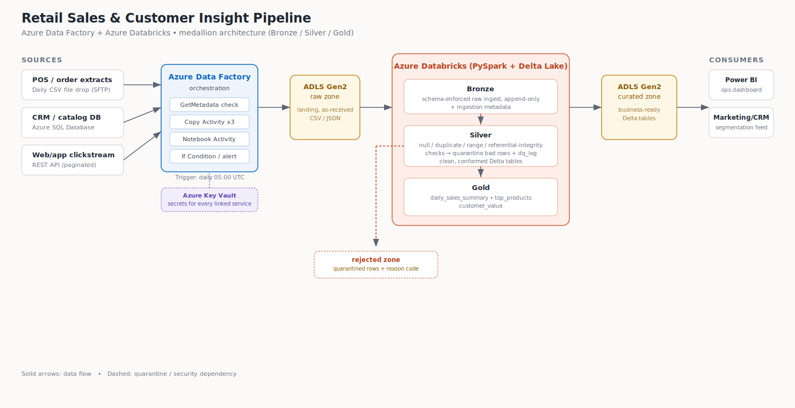

# Retail Sales & Customer Insight Pipeline

An Azure Data Factory + Azure Databricks pipeline built to demonstrate a medallion-architecture
(Bronze/Silver/Gold) data platform for an online retail business, with data-quality enforcement
at every layer.



> **About this repo.** This is a self-contained demo build with synthetic sample data, sized to
> run end-to-end on the Azure free tier. It mirrors a real pattern used in production retail data
> platforms: multi-source ingestion, schema-enforced raw landing, explicit quality gates before
> data is trusted, and curated business marts. If you're using this to prep for an interview where
> you have real prior experience but no access to that environment anymore, swap in your own
> anonymised numbers/specifics where you can speak to them directly — that's the strongest version
> of the presentation.

---

## 1. What this covers (mapped to the brief)

| Interview ask | Where it's answered |
|---|---|
| What sources were used | [Section 3 — Sources](#3-sources) |
| How data was transferred with quality checks | [Section 4 — Pipeline & Data Quality](#4-pipeline--data-quality) |
| What the output dataset/data product was used for | [Section 5 — Data Products](#5-data-products) |
| Data challenges | [Section 6 — Data Challenges](#6-data-challenges) |

A ready-to-read 10-minute script is in [`docs/presentation-notes.md`](docs/presentation-notes.md).

---

## 2. Architecture

Sources → **Azure Data Factory** (orchestration & ingestion) → **ADLS Gen2 raw zone** →
**Azure Databricks** (Bronze → Silver → Gold, PySpark + Delta Lake) → **ADLS Gen2 curated zone** →
**Power BI** / downstream consumers.

- **Bronze**: raw data landed as-is with schema enforcement and ingestion metadata. Append-only —
  full history preserved for replay/audit.
- **Silver**: data-quality checks applied (not-null, de-duplication, referential integrity, value
  range). Failing rows are quarantined with a reason code, not silently dropped.
- **Gold**: business aggregates — the actual data products consumers query.

## 3. Sources

Three source types were deliberately included to cover the connector patterns ADF is commonly used for:

| Source | System type | ADF connector | Why this shape |
|---|---|---|---|
| Order/transaction extracts | Daily file drop from the POS/e-commerce platform | Blob/SFTP → Copy Activity | Represents the common "batch file from a system we don't own" pattern |
| Customer & product catalog | CRM / commerce database | Azure SQL Database connector | Represents pulling reference/dimension data straight from a relational source |
| Web & app clickstream | Analytics events platform | REST API connector (paginated) | Represents an API source with pagination and rate limits |

Sample files are in [`data/sample/`](data/sample/) — `orders_raw.csv`, `customers.csv`,
`products.csv`, `clickstream_events.jsonl`. The orders file has several intentional data-quality
issues baked in (null keys, a duplicate row, an orphaned product reference, a negative quantity, a
malformed date) so the Silver notebook has real things to catch — useful to point at directly in
the demo.

## 4. Pipeline & Data Quality

1. **ADF `pl_ingest_orders`**: `GetMetadata` confirms the file exists and is non-empty before
   copying — fails loudly rather than producing a silent empty run.
2. **ADF `pl_ingest_crm_catalog`** and **`pl_ingest_clickstream`**: pull the DB and API sources in
   parallel into the raw zone.
3. **ADF `pl_master_orchestration`**: runs the three ingestion pipelines, then triggers the
   Databricks notebooks in sequence via `DatabricksNotebook` activities, passing parameters
   (paths, dates) at each step.
4. **Databricks `01_bronze_ingest_validate`**: schema-enforced landing into Delta, with
   `_ingest_ts` / `_source_file` lineage columns.
5. **Databricks `02_silver_clean_transform`**: runs the shared checks in
   [`tests/data_quality_checks.py`](tests/data_quality_checks.py) — not-null, de-dup, referential
   integrity against dimension tables, value-range — logging metrics to a `dq_log` Delta table and
   quarantining failures to a `rejected` zone with a reason code.
6. **ADF `IfCondition`**: reads the Silver notebook's reject-rate output; above a 5% threshold it
   posts an alert (Teams webhook) before Gold runs — informational, not a hard stop (see
   [Section 6](#6-data-challenges) for why).
7. **Databricks `03_gold_aggregate`**: builds the curated business tables, registered with **Liquid
   Clustering** (`CLUSTER BY`) rather than partitioning/ZORDER — Databricks' current recommendation
   for new tables. Clustering keys were chosen from the columns Power BI actually filters by:
   `(order_date, region)` on `daily_sales_summary`, `category` on `top_products`,
   `customer_segment` on `customer_value`.

This is the same pattern as Great Expectations / Delta Live Tables expectations, implemented as a
small reusable PySpark module so every notebook applies checks the same way and logs them the same
way — worth mentioning if asked "why not a framework."

## 5. Data Products

| Gold table | Used by | Purpose |
|---|---|---|
| `daily_sales_summary` | Power BI ops dashboard | Daily trading view by region/category for the merchandising team |
| `top_products` | Power BI / weekly review | "What's moving" ranking by revenue and units |
| `customer_value` | Marketing/CRM | Lifetime value and recency, feeding segmentation/campaign targeting |

## 6. Data Challenges

Concrete, demonstrable ones built into this project (good material for the Q&A):

- **Schema/format drift** — the source occasionally sent `order_date` as `DD-MM-YYYY` instead of
  `YYYY-MM-DD`. Handled with `coalesce()` over multiple `to_date` parses rather than failing the
  whole batch.
- **Orphaned foreign keys** — an order referencing a `product_id` that doesn't exist in the catalog
  (e.g. a product was deleted/retired but its old orders still arrive). Caught by the referential
  integrity check and quarantined rather than joined into a `null` silently.
- **Duplicate records** — retried Copy Activities or overlapping extracts can land the same row
  twice. De-duplicated on natural key, but logged so volume is visible.
- **API rate limiting** — the clickstream REST source returned HTTP 429s under the daily pull;
  fixed with retry policy + request interval in the Copy Activity rather than failing the pipeline.
- **A blocking quality gate caused a worse outage than the bad data itself** — an early version
  failed the whole pipeline on any reject, which meant one malformed file took down the entire
  next-day dashboard. Changed to: quarantine + log + alert, but let Gold still run on the clean
  subset. This is a good "what would you do differently" / judgement-call story for the interview.
- **Cost control on a free-tier build** — job clusters with auto-termination, rather than an
  always-on interactive cluster, to keep this inside the free credit.

---

## 7. Building this yourself on the Azure free tier

You don't need any existing Azure access — the free account covers everything here.

**Day 1 — Azure setup**
1. Sign up for the [Azure free account](https://azure.microsoft.com/free) ($200 credit for 30
   days, plus always-free services — no charge unless you explicitly move to pay-as-you-go).
2. Create a **Resource Group**, e.g. `rg-retail-demo`.
3. Create a **Storage Account** with **Data Lake Gen2 (hierarchical namespace) enabled** — this is
   the checkbox that turns a plain Blob account into ADLS Gen2. Create containers: `landing`,
   `raw`, `processed`, `rejected`, `curated`.
4. Create an **Azure Key Vault** — used to store the storage/SQL/Databricks secrets instead of
   hardcoding them in ADF.
5. (Optional, for the SQL-source talking point) Create an **Azure SQL Database** (Basic/Serverless
   tier) and load `customers.csv` / `products.csv` into two tables.
6. Create an **Azure Databricks workspace** (Standard tier is enough and cheaper than Premium for
   a demo; Premium only needed for Unity Catalog/passthrough auth).
7. Create an **Azure Data Factory** instance.

**Day 2 — Ingestion**
1. Upload the sample files from `data/sample/` into the `landing` container (and your SQL tables,
   if used).
2. In ADF Studio, create the linked services in [`adf/linkedServices/`](adf/linkedServices/) —
   recreate them via the UI (Manage → Linked services → New) using your own resource names; the
   JSON here documents the config and auth pattern (Key Vault-backed secrets, managed identity).
3. Recreate the datasets and pipelines from [`adf/datasets/`](adf/datasets/) and
   [`adf/pipelines/`](adf/pipelines/) — either via ADF's "import from JSON" in the Author UI, or by
   building each Copy/GetMetadata/IfCondition activity manually and using the JSON as your
   reference for expressions and settings.
4. Debug-run `pl_ingest_orders`, `pl_ingest_crm_catalog`, `pl_ingest_clickstream` individually and
   confirm files land in `raw`.

**Day 3 — Transform**
1. In Databricks, create a Repo linked to this GitHub repo (Repos → Add Repo) so the notebooks are
   version-controlled alongside the ADF JSON.
2. Set up an ADLS Gen2 connection from Databricks — an OAuth service principal with its secret in
   Key Vault, referenced via a Databricks secret scope (`databricks secrets create-scope`), is the
   pattern used in the linked service file; avoid mounting with account keys.
3. Run `01_bronze_ingest_validate.py`, then `02_silver_clean_transform.py`, then
   `03_gold_aggregate.py` interactively first to confirm each layer, then wire them into ADF as
   `DatabricksNotebook` activities per `pl_master_orchestration.json`.
4. Run the master pipeline end-to-end; check the `dq_log` Delta table and `rejected` zone populate
   as expected.

**Day 4 (buffer) — polish & rehearse**
1. Export the final ADF pipelines as ARM templates (Author → Export ARM Template) and commit them
   alongside the hand-written JSON here for a real export to reference.
2. Connect Power BI (free desktop app) to the `curated` container's Delta tables (via the Databricks
   SQL endpoint or a simple Parquet read) for one real chart, if time allows — even one screenshot
   of a dashboard is a strong visual for the presentation.
3. **Cost control**: stop/delete the Databricks cluster and consider deleting the SQL Database when
   you're not actively using them — storage and ADF are cheap, compute is what burns the credit.
4. Rehearse using [`docs/presentation-notes.md`](docs/presentation-notes.md).

---

## Repo structure

```
retail-databricks-adf-pipeline/
├── README.md
├── docs/
│   ├── architecture-diagram.svg
│   └── presentation-notes.md
├── data/sample/                  # synthetic sample data, incl. seeded DQ issues
├── adf/
│   ├── linkedServices/
│   ├── datasets/
│   ├── pipelines/
│   └── triggers/
├── databricks/notebooks/         # 01_bronze, 02_silver, 03_gold
└── tests/
    └── data_quality_checks.py    # shared PySpark DQ check functions
```
